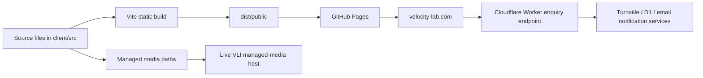
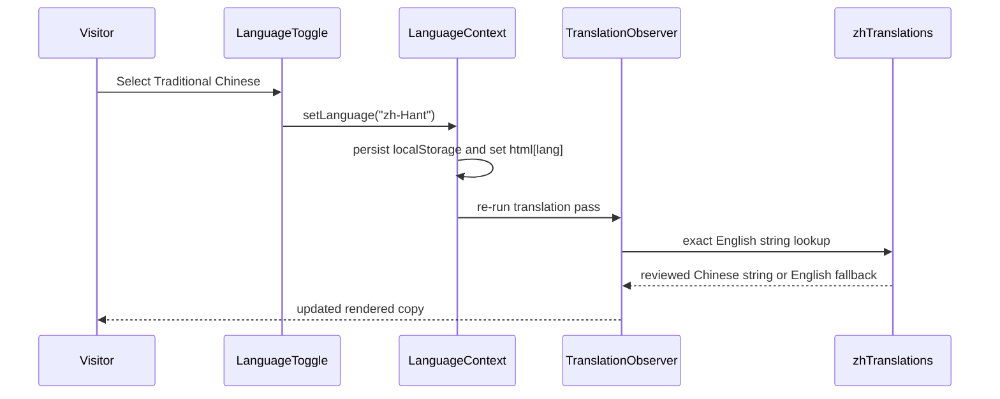

# Velocity Lab Public Website: Engineering and Design Manual

This manual is the technical source of truth for engineers and web-design engineers maintaining the Velocity Lab public site. It describes the static GitHub Pages delivery path, React source structure, bilingual runtime, visual system, managed media, enquiry boundary, quality gates, and safe extension patterns.

> **Scope:** This document describes the public React website published by GitHub Pages. The repository also contains server, database, owner-dashboard, and Cloudflare Worker code from the fuller VLI application. Those systems are related but are not bundled into the public Pages artifact.

## 1. System overview

The public site is a React 19, TypeScript, Vite, Tailwind 4, and Wouter application. Vite produces a static bundle. A GitHub Actions workflow deploys that bundle to GitHub Pages when `main` changes. The public custom domain is `velocity-lab.com`.



The Pages workflow is defined in [`.github/workflows/static.yml`](../.github/workflows/static.yml). It installs locked dependencies, runs `pnpm run build:pages`, rewrites `/manus-storage/` paths to the live managed-media host, copies `index.html` to `404.html` for client-side route fallback, and publishes `dist/public`.

## 2. Runtime boundaries

| Boundary | Public Pages behaviour | Engineering implication |
| --- | --- | --- |
| React UI | Runs fully in the browser. | Keep public pages usable without server rendering. |
| Routing | Wouter renders client-side routes. | Every route needs an SPA fallback, supplied by the workflow. |
| Managed media | Builds reference `/manus-storage/...` paths. | Do not commit large binary content into source directories. |
| Public enquiries | Production static host posts to the Cloudflare Worker endpoint. | Maintain the typed client contract and never expose secrets. |
| Full application/admin | Requires the full VLI runtime rather than Pages. | Do not claim owner/admin behaviour is available in static Pages. |
| Translation | English source copy is translated at runtime from a reviewed exact-match map. | Treat English source strings as translation keys. |

## 3. Source layout and ownership

The project contains historical full-stack files, but the public delivery source of truth is mostly `client/src/`.

| Path | Responsibility | Typical editor |
| --- | --- | --- |
| `client/src/App.tsx` | Route registry, providers, page shell. | Engineer. |
| `client/src/pages/` | Public page composition and page-specific content. | Engineer or advanced content editor. |
| `client/src/components/` | Shared header, footer, dialogs, pricing, motion, language UI. | Engineer. |
| `client/src/lib/` | Navigation, pricing, media, copy-support, static-host helpers, translations. | Engineer; some data files are safe for content edits. |
| `client/src/contexts/` | Language and theme state. | Engineer only. |
| `client/src/index.css` | Global visual system and responsive rules. | Web-design engineer. |
| `client/src/**/*.test.ts(x)` | Vitest regression contracts. | Engineer. |
| `.github/workflows/static.yml` | Static build and GitHub Pages deployment. | Release engineer. |
| `worker/` | Cloudflare enquiry service artifacts. | Backend or platform engineer. |
| `server/`, `drizzle/` | Full-application backend and database artifacts. | Full-stack engineer; not needed for routine Pages changes. |

### Public route map

Routes are registered in [`client/src/App.tsx`](../client/src/App.tsx).

| Route | Page module | Notes |
| --- | --- | --- |
| `/` | `Home.tsx` | Public landing page. |
| `/dronesportsreferee` | `Product.tsx` | Smart Referee sales and decision-support experience. |
| `/product` | `Equipment.tsx` | Equipment catalogue surface. |
| `/services` | `Services.tsx` | Public services surface. |
| `/contact` | `Contact.tsx` | Public contact and enquiry page. |
| `/people`, `/use-cases`, `/pricing` | Corresponding page modules | Available routes; not all are primary-navigation items. |
| `/owner` | `OwnerEnquiries.tsx` | Full-app-oriented route; do not rely on it on static Pages. |

Use `staticSitePath(...)` from [`client/src/lib/staticPreview.ts`](../client/src/lib/staticPreview.ts) for internal links created outside Wouter components. The helper protects subpath previews and static-base configurations.

## 4. Application composition

`App.tsx` creates the public application shell in this order:

1. `ErrorBoundary` guards against client rendering failures.
2. `LanguageProvider` persists `en` or `zh-Hant` and updates `<html lang>`.
3. `ThemeProvider` applies the dark Flight-Deck theme.
4. `TooltipProvider` and `Toaster` supply shared interaction primitives.
5. `WouterRouter` uses the static base helper.
6. `RevealMotionController` applies reveal behavior.
7. `Router` selects the page.
8. `WebsiteTranslationObserver` translates reviewed source text and selected attributes after rendering.

This sequence matters. Do not mount the translation observer outside the language provider or outside the rendered root.

## 5. Navigation, header, and footer

Navigation content is declared in [`client/src/lib/siteNavigation.ts`](../client/src/lib/siteNavigation.ts). `SiteHeader.tsx` renders the desktop and mobile forms. The mobile menu may use `mobileLabel`, allowing a shorter label without changing the desktop menu.

| Requirement | Implementation rule |
| --- | --- |
| Add a public route | Add page module, route in `App.tsx`, navigation item if needed, and tests. |
| Rename a menu label | Change `siteNavigation.ts`, add a translation key, confirm desktop and mobile. |
| Add a link in a page or footer | Use `staticSitePath` for internal routes. |
| Change shared contact details | Prefer `contactDetails.ts` over duplicate literals. |

The footer is a public content component. Keep its offers, links, email, and final CTA aligned with header taxonomy.

## 6. Bilingual architecture

### Operating model

English text in components is the source. `WebsiteTranslationObserver.tsx` traverses rendered text nodes and selected attributes, then uses `traditionalChineseTranslations` from [`client/src/lib/zhTranslations.ts`](../client/src/lib/zhTranslations.ts) when the active language is `zh-Hant`.



### Translation rules

| Rule | Reason |
| --- | --- |
| Maintain an exact English key for every edited public string. | The lookup is exact, including punctuation and whitespace. |
| Change English and Chinese in the same pull request. | Avoids an English fallback in Chinese mode. |
| Preserve `data-live-metric` on rolling values. | Animated metrics are deliberately excluded from static string replacement. |
| Preserve `.vli-language-toggle` exclusion. | The control must not translate itself into an unusable state. |
| Test long Chinese headings at mobile width. | Chinese copy can overflow where English does not. |

The observer translates these attributes when present: `aria-label`, `aria-description`, `alt`, `placeholder`, and `title`. Write accessible English source attributes and add reviewed translations for material public changes.

## 7. Visual-system maintenance

The site uses a dark Flight-Deck visual system with turquoise accent, high-contrast paper text, grid-led spacing, and restrained reveal motion. Global rules are in [`client/src/index.css`](../client/src/index.css); page-local styling is mostly expressed with Tailwind utilities.

### Design rules

| Area | Maintain this principle |
| --- | --- |
| Colour | Retain dark ink backgrounds, turquoise accent, and legible white/off-white copy. |
| Hierarchy | Use eyebrow, large headline, short supporting copy, then a clear action. |
| Cards | Prefer one compositional idea per card; avoid stacking unrelated claims. |
| Motion | Use opacity and transform; respect reduced motion. |
| Mobile | Start from narrow widths; test 375 px for overflow and touch targets. |
| Proof claims | Use supplied assets and qualified statements; do not invent testimonials, measured outcomes, or guarantees. |

When adding a new repeated UI treatment, expose a small exported presentation policy or data object and cover it in a Vitest contract. This makes visual intent more durable than an undocumented string of utility classes.

## 8. Smart Referee page structure

[`client/src/pages/Product.tsx`](../client/src/pages/Product.tsx) is the main Smart Referee page. It contains exported content/configuration constants followed by the page JSX. Keep this distinction: data and presentation policies appear near the top; rendered sections follow inside the component.

| Concern | Primary implementation |
| --- | --- |
| Page order | `smartRefereePageHierarchy` export. |
| B2B panels and proof points | Exported arrays such as `proofPoints`, `organiserPainPanels`, and `sharedExperienceSections`. |
| Rolling metrics | `RollingMetric` plus the language-aware metric formatter. |
| Responsive Chinese fit | `smartRefereeChineseHeadingFitPolicy` and scoped CSS. |
| Rule-support references | `smartRefereeMedia.ruleSupportLogos` and `ruleSupportLogoGroupPresentation`. |
| Pricing experience | `RefereePricingConfigurator` and `pricingConfig.ts`. |

Keep rule-reference logos and copy factual. The presentation can show supplied references, but should not imply partnership, approval, certification, or endorsement unless the business has documentary authority.

## 9. Media pipeline

Public media is intentionally stored outside the repository source tree. The correct process is:

```text
Original supplied file
  → /home/ubuntu/webdev-static-assets/
  → manus-upload-file --webdev
  → /manus-storage/<returned-path>
  → React source reference
  → GitHub Action rewrite to managed live asset host
```

The GitHub Actions workflow rewrites the public build’s `/manus-storage/` values to `https://velolab-gkpolzge.manus.space/manus-storage/`. Therefore, source JSX should use the returned `/manus-storage/...` path, not a guessed external URL.

### Media acceptance checklist

- Confirm the asset is supplied, licensed, or approved for the intended public use.
- Use accurate, concise `alt` text.
- Prefer real-world photos for services, equipment, and events when credibility matters.
- Keep an aspect-ratio treatment appropriate to the page and mobile layout.
- Confirm the image has loaded in the deployed Pages site, not only locally.

## 10. Static enquiries and external services

The static frontend uses [`client/src/lib/staticEnquiry.ts`](../client/src/lib/staticEnquiry.ts) for public production form submission. On `velocity-lab.com`, forms post typed payloads to the Cloudflare Worker endpoint and include a Turnstile token.

| Do | Do not |
| --- | --- |
| Keep the request shape compatible with `StaticEnquiryInput`. | Put Turnstile, email, or worker secrets in the client. |
| Test success and failure states after modifying a form. | Assume the full-app `/owner` experience runs on GitHub Pages. |
| Preserve honeypot and validation fields when updating forms. | Remove anti-abuse checks for a visual simplification. |

Worker configuration and database/email details belong to the platform boundary. Changes there require a backend review and separate deployment verification.

## 11. Quality gates

Run all three commands after any production-bound source change:

```bash
pnpm test
pnpm check
pnpm build:pages
```

| Gate | Detects |
| --- | --- |
| `pnpm test` | Broken content contracts, utility behavior, translation coverage, and server-adjacent regression tests. |
| `pnpm check` | TypeScript import, type, and JSX mistakes. |
| `pnpm build:pages` | Static Vite build and GitHub Pages compatibility. |

Use the existing page-level tests as contracts, not merely implementation details. When changing a data export, headline, package rule, or media source, update the matching test in the same change.

### Responsive verification

Verify at least:

| View | Minimum check |
| --- | --- |
| Desktop, English | Section hierarchy, media loading, navigation, copy. |
| Desktop, Traditional Chinese | Reviewed translations and visual fit. |
| 375 px mobile, English | No horizontal overflow; usable menu and calls to action. |
| 375 px mobile, Traditional Chinese | Headline fit, compact labels, no clipped copy. |

## 12. Release procedure

```bash
git status
pnpm test
pnpm check
pnpm build:pages
git add <specific files>
git commit -m "Describe the intentional change"
git push origin main
```

Then:

1. Open the latest **Deploy static content to Pages** workflow in GitHub Actions.
2. Wait for both build and deploy jobs to succeed.
3. Review `https://velocity-lab.com` with a cache-busting query such as `?revision=<commit>`, in both languages and at mobile width.
4. Record the commit, test result, and deployment run in release notes or the maintenance ledger.

### Failure triage

| Symptom | First inspection |
| --- | --- |
| Build failure | `pnpm build:pages`, then TypeScript errors and recent imports. |
| English appears in Chinese view | Exact source string and `zhTranslations.ts` key. |
| Horizontal mobile overflow | The section’s `scrollWidth`, fixed widths, nowrap rules, and Chinese font scale. |
| Missing deployed media | Returned managed-media path and workflow rewrite result. |
| Form failure only on public domain | `staticEnquiry.ts`, Turnstile integration, Worker logs/configuration. |
| Broken route after deployment | `App.tsx` route plus static link helper and 404 fallback. |

## 13. Change-control rules

1. Do not edit generated root `assets/` files.
2. Do not hardcode fabricated reviews, ratings, outcomes, savings, or testimonials.
3. Do not commit credentials, Turnstile secrets, API keys, or email tokens.
4. Do not replace real supplied service media with AI-generated imagery without explicit approval.
5. Do not remove bilingual exclusions from live metrics or language controls.
6. Do not alter the Pages workflow or enquiry endpoint without a deployment and security review.
7. Do not use raw links for internal navigation when `staticSitePath` is appropriate.

## 14. Recommended extension pattern

For a new public section:

1. Define its copy and media data near the top of its page module.
2. Add the JSX section with semantic heading hierarchy and responsive classes.
3. Add English-to-Chinese translation entries for visible copy and relevant attributes.
4. Add a page-level test for the new data or interaction contract.
5. Test both languages, desktop and mobile.
6. Build and deploy through the standard Pages workflow.

This keeps the website editable by content teams while retaining predictable engineering boundaries.
